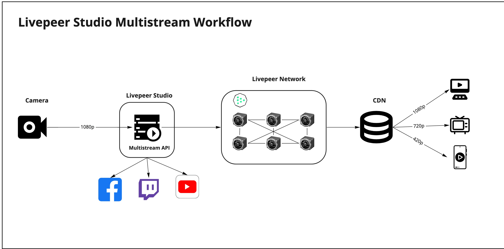
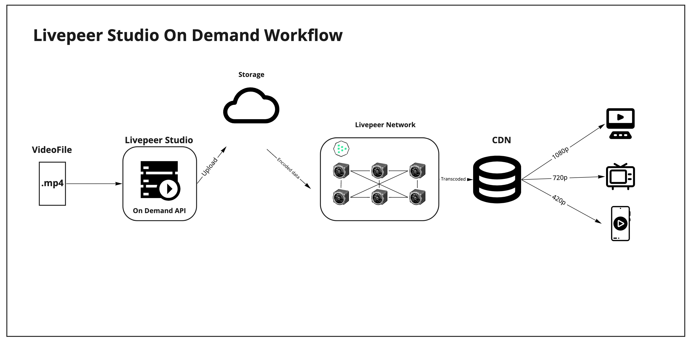
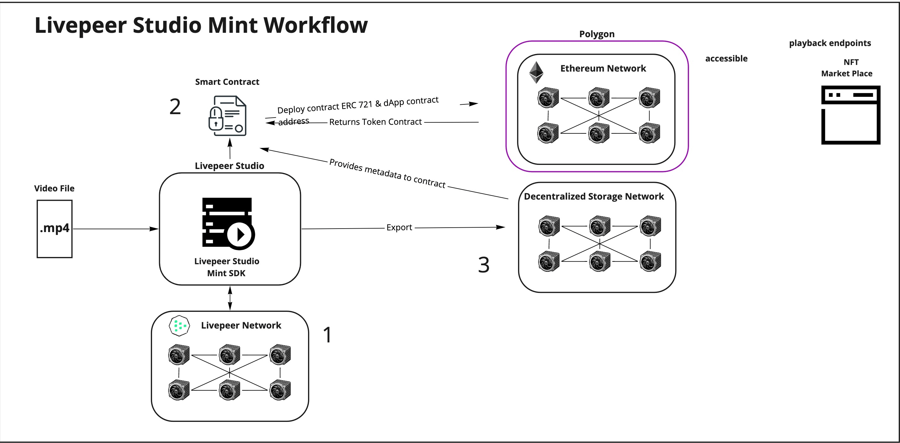

There are different options for streaming owrkflow depending on devices used.
Here are streaming workflows for two commonly used methods:

- Using a streaming software
- Using In-Browser 

To learn more about these methods, visit the tutorial [How to Stream with Livepeer Studio](pending)

The following are the architecture and workflows of the different features available in Livepeer Studio utilizing the decentralized transcoding of the Livepeer network:

- Livestreaming
- Multistreaming
- On Demand
- Mint

## Livestream Workflow

- An incoming audio/video feed from a device passes through a streaming software like OBS or a web browser via WebRTC
- Livepeer Studio sends the feed to the Livepeer network for transcoding
- The feed gets transcoded to multiple renditions and sent to the CDN
- The CDN sends specific rendition of the feed based on the viewers device and network capabilities when a request is made

## Multistream Workflow

- An incoming audio/video feed from a device passes through a streaming software like OBS or a web browser via WebRTC at the same time, Livepeer Studio will redirect this feed into other streaming platforms
- Livepeer Studio sends the original feed to the Livepeer network for transcoding
feed gets transcoded to multiple renditions and sent to the CDN
- The CDN sends specific rendition of the feed based on the viewers device and network capabilities when a request is made

## On Demand Workflow

- An asset can be provided by **either** a downloadable URL link **or** by uploading a `.mp4` file
  - Importing a URL
    - Asset in downloadable link is transcoded in the Livepeer Network, gets passed back to Livepeer Studio and saved in storage
  - Uploading a file  
    - Generates a URL for storage if `Upload` option is used
    - File provided itranscoded in the Livepeer Network, gets passed back to Livepeer Studio and saved in storage
  - Stored assest now contains the `playbackUrl` used for viewing
  - The CDN sends specific rendition of the asset based on the viewers device and network capabilities when a request is made

## Mint Workflow

- Livepeer Studio takes provided `.mp4` asset and metadata provided by the user
- Write and deploy the smart contract
- Pass in the metadata from uploaded asset
- Sends asset to Livepeer's decentralized transcoding network for transcoding
- Mint the video NFT by calling the Ethereum blockchain (Polygon layer 2 solution is used for mosre cost effective gas fees)

