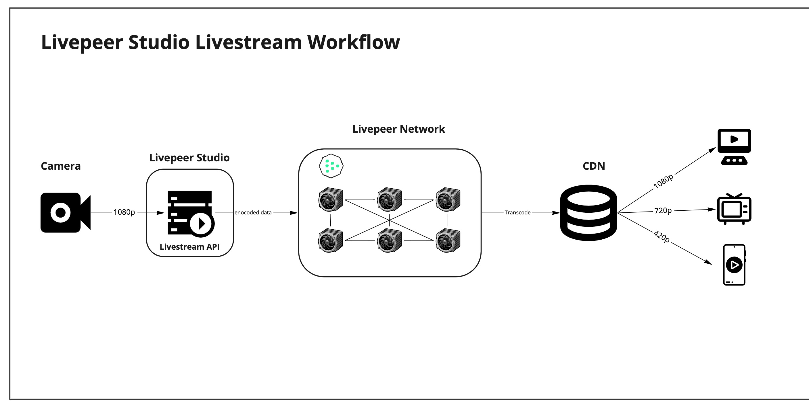

From streaming to delivery, The following are scenarios with the architecture and workflow delivering the highest quality video for your viewing:

- Livestreaming
- Multistreaming
- On Demand streaming
- Mint

1. streaming to uploading 
1. device of your choice (cameras/mobile apps/stored video files) 
1. utilize the Livepeer Studio APIs 
1. leveraging the Livepeer transcoding network 

## Livestream Workflow

This is  placeholder

## Multistream Workflow

This is  placeholder

## On Demand Workflow

This is  placeholder

## Mint Workflow

This is  placeholder
